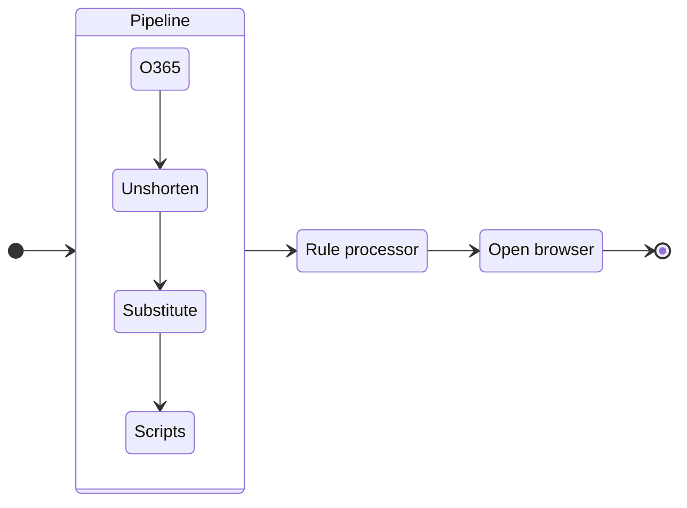

# URL Processing

URL Processing was introduced in v3.7.0 as a way to customize URL processing even further and streamline the process of URL un-shortening and unwrapping that already existed.

The functionality is available from the **Pipeline** menu.

To understand how URL processing works, let's see how %product% processes URLs:

Every time you click on a link, it first goes via a "Pipeline" that makes optional transformations on it. This includes unwrapping Office 365 links, un-shortening URLs, and applying substitutions, all described below. Since v4.1.0 you can also [run custom scripts](scripting.md) on the URL.

Rule processor then applies rules to the URL and opens the browser based on the rule.

## Un-shortening

<warning>
Internet access is required for this feature to work. If internet is not available, shortened URLs will be opened as is.
</warning>

Since v3.5.0 URL un-shortening is enabled by default due to the fact shortened URLs mask target link and make it impossible to apply a rule to it.

For instance pressing [https://bit.ly/47EZHSl](https://bit.ly/47EZHSl) will actually open [https://github.com/aloneguid/bt](https://github.com/aloneguid/bt), allowing potential attackers to evade configured rules.

%product% supports the most popular URL shorteners, the list of which you can find [here](https://github.com/aloneguid/bt/blob/master/bt/app/pipeline/unshortener.cpp). If it's not in the list, fire up an issue or a PR.

## Office 365 link unwrapping

**Office 365** links are unwrapped for rule matching, but for security reasons wrapped URL is open. For instance,

`https://eur02.safelinks.protection.outlook.com/?url=https%3A%2F%2Fwww.google.com`

will apply rules to `http://www.google.com` but still open the original URL.

<tip>
Link unwrapping is applied to any URL whose domain name ends with <code>.safelinks.protection.outlook.com</code> or equals to <code>statics.teams.cdn.office.net</code> (MS Teams links).
</tip>

## Substitutions

Substitutions works as you would expect - finds a substring in the incoming URL and replaces it with another substring.

For instance, if you want to replace `google.com` with `bing.com`, you would do the following:

1. Open "Substitutions" window.
2. Add a new substitution by clicking `Add` button.
3. Enter `google.com` in the `Find` field.
4. Enter `bing.com` in the `Replace` field.

For more advanced scenarios, you can use regular expressions.

To test substitutions, use the "Test" section on the top. It will show you the result of the substitution as you type in real time.

## Scripts

Since v4.1.0 %product% can run custom scripts on the URL. This is a powerful feature that allows you to manipulate the URL in any way you want. For instance, you can add a query parameter, remove a query parameter, or even change the domain name. The possibilities are endless. [Learn more](scripting.md) about scripting.

